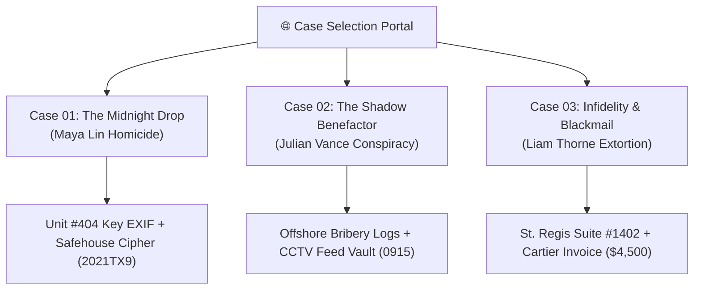

<div align="center">

# 📱 LOST SIGNAL
### *Found-Phone Forensic Murder Mystery & Investigation Suite*

[](https://reactjs.org/)
[](https://www.typescriptlang.org/)
[](https://tailwindcss.com/)
[](https://www.framer.com/motion/)
[](https://github.com/pmndrs/zustand)
[](https://developer.mozilla.org/en-US/docs/Web/API/Web_Audio_API)

<br/>

**LOST SIGNAL** is a full-fidelity, interactive "found-phone" detective simulation web application. Players gain direct forensic access to the unlocked smartphones of homicide victims, corporate conspirators, and unfaithful targets. Cross-examine authentic mobile apps, extract raw EXIF coordinates, crack encrypted notes, and indict suspects across progressive mystery files.

[Explore Cases](#-case-files--mystery-dossiers) • [Simulated Apps](#-simulated-mobile-os-ecosystem) • [Forensic Mechanics](#-forensic-mechanics--puzzles) • [Quick Start](#-quick-start)

</div>

---

## 🌟 Key Highlights

- **🍎 Apple Keynote Landing Page**: Apple product launch-style case directory with filter pills (*Homicide*, *Conspiracy*, *Infidelity*), victim bios, difficulty ratings, and instant device boot triggers.
- **📱 1:1 Authentic Mobile OS Shell**: Continuous-curvature squircles (`rounded-[22%]`), frosted glass dock, iOS 18 stencil clock, dynamic TrueDepth Island, and native pull-down Control Center.
- **🗺️ True EXIF Geotagging**: Raw camera parameters (aperture, shutter speed, ISO, focal length, resolution) and interactive Apple Maps location pinpoint extraction.
- **🔊 Procedural Web Audio Engine**: Zero-dependency synthesizer generating authentic DTMF dialer tones, camera shutter acoustics, lock clicks, and real-time voice memo waveform visualizers.
- **🔐 Two-Factor Cipher Vaults**: Decrypt password-protected Apple Notes and PIN-locked "Recently Deleted" photo vaults by cross-referencing cab plates, banking deposit dates, and chat logs.

---

## 📂 Case Files & Mystery Dossiers



| Case | Target & Role | Category & Difficulty | Synopsis |
| :--- | :--- | :--- | :--- |
| **Case 01** | **Maya Lin**<br>*(24, Photojournalist)* | `HOMICIDE` • `NORMAL` | Maya was ambushed near Pier 42 after retrieving evidence on city kickbacks. Inspect her iMessage chats, extract GPS EXIF coordinates from locker key photos, and decipher her encrypted Safe House note (`2021TX9`). |
| **Case 02** | **Julian Vance**<br>*(CEO, Vance Holdings)* | `CONSPIRACY` • `HARD` | Billionaire Julian Vance is buying district zoning votes. Inspect recurring $25,000 Helios offshore wire transfers, crack the Recently Deleted photo vault using banking deposit dates (`0915`), and recover the recorded assassination order. |
| **Case 03** | **Liam Thorne**<br>*(Hedge Fund VP)* | `INFIDELITY` • `EXPERT` | Hired by spouse Evelyn Thorne to inspect Liam's smartphone. Expose his secret burner chat with "Coach Dave" (Chloe V.), $4,500 Cartier diamond bangle invoice, St. Regis Suite #1402 alibi (`45001402`), and $200,000 extortion scheme. |

---

## 📱 Simulated Mobile OS Ecosystem

Every case dynamically configures the target smartphone with relevant applications, realistic everyday noise, spam, and hidden evidence:

| App Icon | Application | Key Features & Forensic Mechanics |
| :---: | :--- | :--- |
| 💬 | **Messages (iMessage)** | Authentic chat bubbles, read receipts, whistleblower threads (Viper), and photo attachments with direct EXIF inspection jumps. |
| 📸 | **Photos (Apple Photos)** | 2-column photo grid, contained lightbox viewer, **1:1 Apple EXIF Info Drawer** (camera specs, GPS coordinates, Apple Maps preview), and PIN-locked Recently Deleted album. |
| 📒 | **Notes (Apple Notes)** | Inset grouped list, drafts, and encrypted Safe House / Alibis vaults with contextual two-factor passcode deciphering. |
| 📞 | **Phone & Voicemail** | Visual voicemail inbox with real-time waveform scrubber & live speech-to-text transcript, recents call log, and DTMF dialer keypad. |
| 🧭 | **Safari Browser** | Pinned bookmarks (The Tribune, Maps, Apple), search history (St. Regis suites, Cartier value, Swiss banking confidentiality), and news article reader. |
| ✉️ | **iCloud Mail** | Realistic inbox with unread badges, email threads, PDF invoices, work compliance audits, receipts, and everyday spam. |
| 🎙️ | **Voice Memos** | Field interview recordings, acoustic frequency analysis (82Hz harbor foghorn), and playback visualizer. |
| 📈 | **Stocks & Trading** | Thorne Capital live portfolio chart, tickers ($THRN, $SPY, $NVDA, $BTC), and Zurich Swiss escrow transfers. |
| 💜 | **Velvet VIP Lounge** | Black Tier private club profile, secret rendezvous messages with Chloe V., and penthouse suite booking logs. |
| 💳 | **Apex Vault (Wallet)** | Titanium debit card, categorized transaction ledger, and flagged offshore Cayman wire transfers. |
| 🗺️ | **MetroPulse (Rides)** | Dark vector GPS route map from 742 Evergreen St to Pier 42, driver rating, vehicle model, and license plate tags. |
| ⚙️ | **Settings** | Apple ID profile, wallpaper selector (Official iOS 18 Titanium Sapphire), audio/mute toggles, and case reset. |

---

## 🧩 Forensic Mechanics & Puzzles

### 1. EXIF Metadata Extraction
Photos taken by victims and suspects contain authentic forensic metadata. Inspecting photos reveals camera models (Sony Alpha 7 IV, iPhone 16 Pro Max), ISO speeds, timestamps, and precise latitude/longitude coordinates plotted on interactive mini-maps.

### 2. Multi-Source Passcode Decryption
Encrypted notes and photo trash albums require cross-referencing information across multiple apps:
- **Case 1 Safe House Cipher**: Retro Archives founding year (`2021`) + MetroPulse cab plate prefix (`TX9`) $\rightarrow$ **`2021TX9`**.
- **Case 2 Recently Deleted PIN**: Date of first recurring $25,000 Helios wire deposit in Banking statements (September 15) $\rightarrow$ **`0915`**.
- **Case 3 Alibis & Offshore Vault**: Cartier Love bangle charge amount (`$4500`) + St. Regis suite number (`1402`) $\rightarrow$ **`45001402`**.

### 3. Forensic Case Board & Grand Jury Indictment
Players can open the **Forensic Case Board** at any time to inspect their pinned evidence, view case objectives, review suspect dossiers, and submit a Grand Jury Indictment to receive an **S-Rank Detective Rating**.

---

## 🛠️ Tech Stack & Architecture

- **Core**: React 18 + TypeScript + Vite
- **Styling**: Tailwind CSS v4 (`@tailwindcss/postcss`) + Custom Glassmorphism System
- **Animation & Gestures**: Framer Motion
- **State Management**: Zustand (Decoupled Game Progress Store + Mobile OS Shell Store)
- **Audio Synthesis**: Procedural Web Audio API Sound Synthesizer (`soundFX.ts`)
- **Icons**: Lucide React + Custom Apple SVG Icons
- **Celebration FX**: Canvas Confetti

---

## 🚀 Quick Start

### Prerequisites
- Node.js (v18 or higher)
- npm or pnpm or yarn

### 1. Clone Repository
```bash
git clone https://github.com/Rushiiii505/Lost-signal.git
cd Lost-signal
```

### 2. Install Dependencies
```bash
npm install
```

### 3. Launch Development Server
```bash
npm run dev
```
Open **`http://127.0.0.1:5173/`** or **`http://127.0.0.1:5174/`** in your browser.

### 4. Build for Production
```bash
npm run build
```

---

## ⌨️ Desktop Keyboard Shortcuts

| Shortcut | Action |
| :--- | :--- |
| <kbd>Esc</kbd> | Return to Home Screen / Close Active Application |
| <kbd>Click Status Bar</kbd> | Toggle iOS 18 Control Center & Notifications |
| <kbd>Click Home Indicator</kbd> | Return to Home Screen |
| <kbd>Click Hardware Buttons</kbd> | Mute / Volume / Power Lock Screen |

---

<div align="center">

Made with ❤️ for detective puzzle enthusiasts & forensic mystery gamers.

*LOST SIGNAL © 2026. All rights reserved.*

</div>
